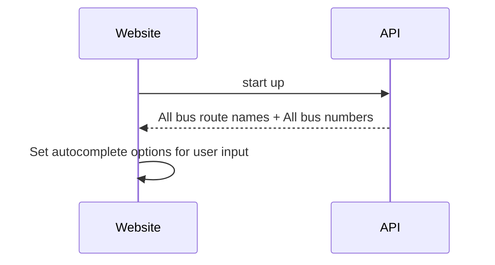
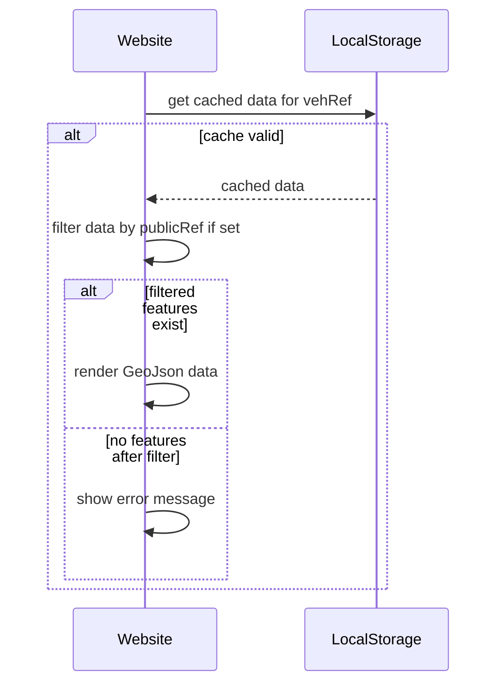
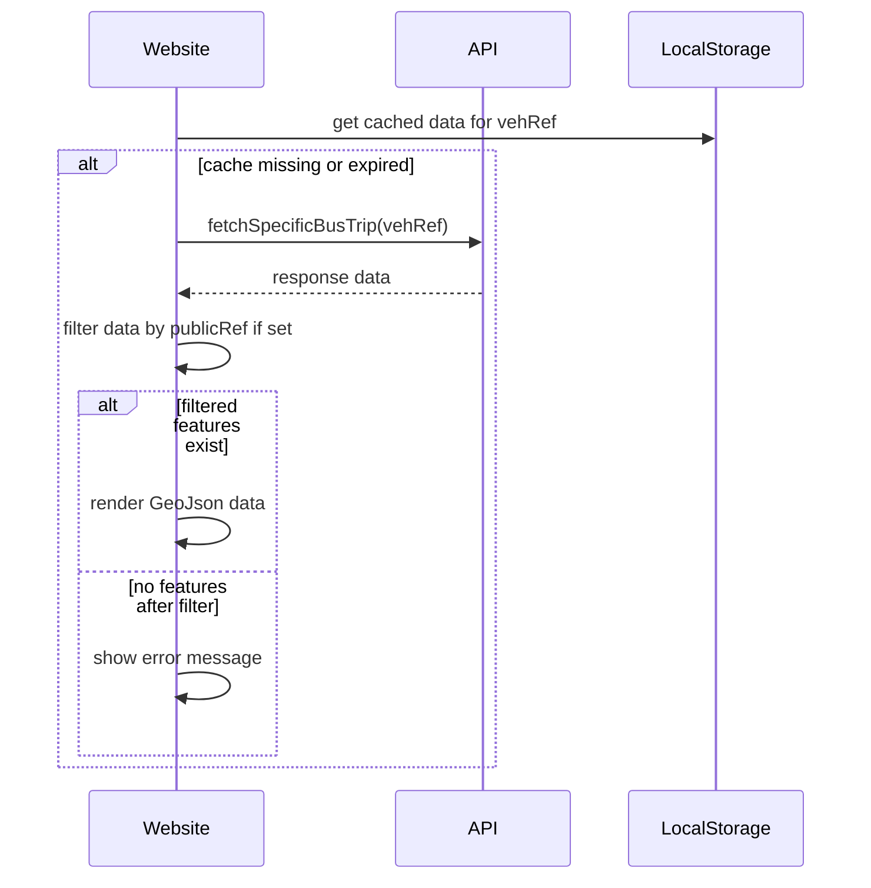
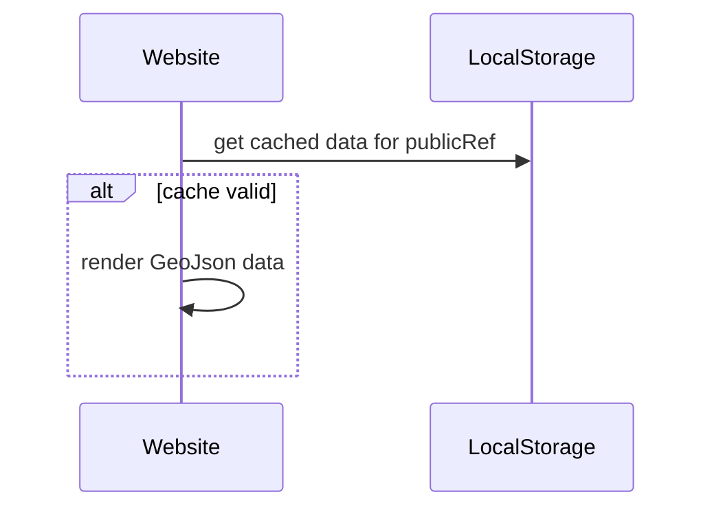
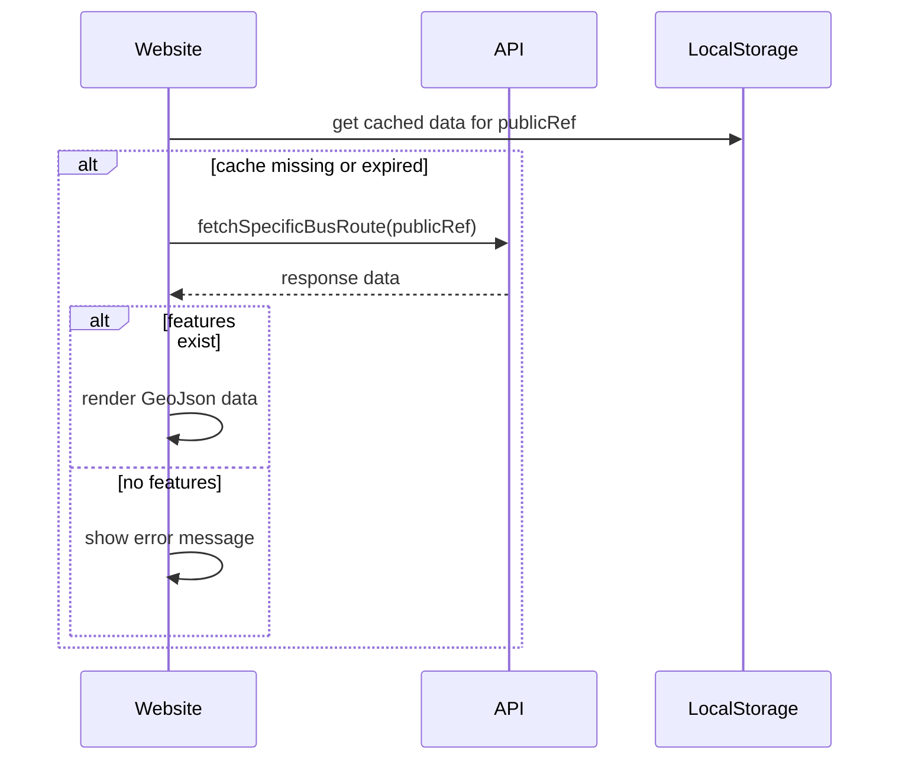

# Sequence Diagram for key workflows

In this section, sequence diagram for key workflows of this application is detailed. Sequence Diagrams are created using the [mermaid.js syntax](https://mermaid.js.org/syntax/sequenceDiagram.html)

## 1. On start up

## 2. vehRef input is given with valid cache

## 3. VehRef input is given with invalid cache (by expiry, non-existence or broken data)

## 4. VehRef input is empty, but publicRef input is given with valid cache

## 5. VehRef input is empty, but publicRef input is given with invalid cache (by expiry, non-existence or broken data)

